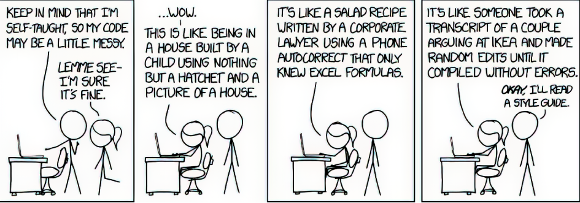

# Coding Tips for Cognitive Researchers

### Amric Trudel  
> Laboratoire de Neurosciences Cognitives Computationnelles  
> École Normale supérieure  
> Paris



## Why using good coding practices?
- Code for your future self (in 2+ months)
- Reproduce any results that you generated in the past.
- Share your code and be easily understood by other researchers
- Someone in your lab can continue your work easily

## 1- Clean Code

### a) Variable and Function Naming
- Meaningful and pronounceable names
  - Variable: **noun** that describes the purpose of the variable 
    `x` --> `observation`
  - Function: verbs
* Don't hesitate to split a calculation over many lines if you use longer variables   
Example: Rescorla-Wagner model
```python
q = 0.5
a = 0.7

# Update rw model
q = q + a * (r - q)
```
Can become:
```python
q_value = 0.5
learning_rate = 0.7

def update_rescorla_wagner_model(reward):
    temporal_difference = reward - q_value
    q_value += learning_rate * temporal_difference
```
Note: Updating variables outside the function is not recommended, but we will see later how to use object-oriented programming to make it cleaner.

### b) Designing good functions
- Computing steps can be encapsulated into clearly named functions to make it understandable.
- Code that can be read like prose is preferable to comments (can you guess why?)
```python
def psychophysical_kernel(actions: np.ndarray, rewards: np.ndarray) ->None:
    features = extract_features(actions, rewards)
    target = extract_target(actions, rewards)
    coefficients, stderror = fit_logistic_regression(features, targets)
    plot_psychophysical_kernel(coefficients, stderrors)
```
- Ideally, your functions should:
  - Be small
  - Do one and ONLY ONE thing
  - Do exactly what their name indicates
  - Have no side effects
  
Each of the subfunctions called in `psychophysical_kernel` can then be defined individually.
### c) Type hinting
Although python is not a strongly typed language, unlike C or java, we can use type hinting in order to allow our IDE to highlight our errors.
- Native types
```python
learning_rate: float = 0.6
action: int = 1
plot_result: bool = True
```
- Types from other libraries
```python
import numpy as np
import torch

trajectory: np.ndarray = np.array([0, 1, 2, 3, 4, 5])
batch: torch.Tensor = torch.Tensor([[0.95, 0.1, 0.34], [0.34, 0.0, 0.2]])
```
- Compound types
```python
from typing import Dict, List, Tuple

parameters: Dict[str, float] = {'learning_rate': 0.7, 'temperature': 0.9}
trials: List[Tuple[int, float]] = [(0, 0.5), (1, 0.2), (0, 0.6)]  # Trials as tuples (action, reward)
```

### d) Code design
- Keep configurability at high levels  
  **config.py**
  ```python
  DATA_DIR = 'data/'
  BATCH_SIZE = 1000
  MAX_REWARD = 100
  N_TRIALS = 80
  ```
- Magic numbers should be named constants (typically in bold characters)
- Be consistent across your code base
- Don't hesitate to create classes for data formats that are outputted by your functions
  ```python
  class Trajectory:
    def __init__(self,
                 actions: np.ndarray,
                 rewards: np.ndarray,
                 description: Optional[str] = None
                 ):
        self.actions = actions
        self.rewards = rewards
        self.description: Optional[str] = description

    def __str__(self) -> str:
        return self.description

    def __len__(self) -> int:
        return self.actions.shape[1]
  ```
- Remove code instead of commenting it out and use **git** to find it back if you need it again.

## 2- Object-Oriented Programming

In Python you can write **classes** to create sections of code that act like **objects**.
```python
import numpy as np
from typing import Tuple

class RescorlaWagner:
    def __init__(self, learning_rate, temperature):
        self.learning_rate = learning_rate
        self.temperature = temperature
        self.q_values = np.array([0.5, 0.5])

    def choose_action(self) -> Tuple[int, float]:
        prob = 1 / (1 + np.exp(-self.temperature * (self.q_values[1] - self.q_values[0])))
        action = np.random.binomial(1, prob)
        return action, prob

    def update(self, last_action: int, last_reward: float) -> None:
        td_error = last_reward - self.q_values[last_action]
        self.q_values[last_action] += self.learning_rate * td_error
```
In this example, we wrote a class for the Rescorla-Wagner model for a binary action.  
- The parameters of the model are written as **attributes** and can be passed to the **constructor** when we instantiate a model:
  ```python
  rw_model = RescorlaWagner(learning_rate=0.7, temperature=0.9)
  ```
- The class has two **methods** that can be called on the instantiated model
  ```python
  action = rw_model.choose_action()
  ```
  And then given a reward:
  ```python
  rw_model.update(action, reward)
  ```

- Data Loader

## 3 - Unit tests

A unit test verifies that a function has the desired behavior given a set of inputs. Developers write extensive unit tests
for their apps before they are deployed in production. In research, it might not be necessary to be as rigorous with the test coverage,
but unit tests can be useful to test critical calculations to make sure they do what is intended.


## 4- Packaging your code
- Structure your code
- Write your dependencies in `requirements.txt`
- Package your code as a library (`setup.py`)

## 4 - Using your code in Notebooks
- `pip install -e .`
- Add magic commands to enable package auto-reload in the notebook:
    ```python
    %load_ext autoreload
    %autoreload 2
    ```

## 5- Versioning with Git
### Basic commands

Saving your code changes to git is a three-step process
- Add the files that contain changes you want to register:  
`git add <files_to_add>`  
- Commit your changes to a snapshot of your code that you might eventually return to:  
`git commit -m "<your commit message>`  
- Push your code to github.com (optional):  
`git push`

Other commands:
- See the state of your uncommited changes:  
`git status`
- Create a branch:  
`git checkout -b <name_of_your_new_branch>`
- Change branches:
`git checkout <name_of_the_branch>`
- Create a tag:
`git tag <name_of_the_tag>`
- Go to a tag:
`git checkout <name_of_the_tag`


### Tips
- Create a `.gitignore` file
- You can create aliases: 
`git config --global alias.hist log --all --decorate --oneline --graph`  
The following is useful to visualize the history of your commits, by typing `git hist`  

### Useful patterns
- Structure your work
- Document your code evolution (no need to )
- Use tags:
  - Model versions
- Branch:
  - Mainly if you work with other people
  - Can be useful if you are trying something out. !! But merge it quickly !!
  - Branches are not meant to contain alternative versions of your code. They are meant to facilitate concurrent development of different features without interference. But the purpose is to have a main branch onto which all evolutions are merged.

### More resources
- https://gitimmersion.com

## 6- Experiments
- Experiment running script

## 7- Data processing

